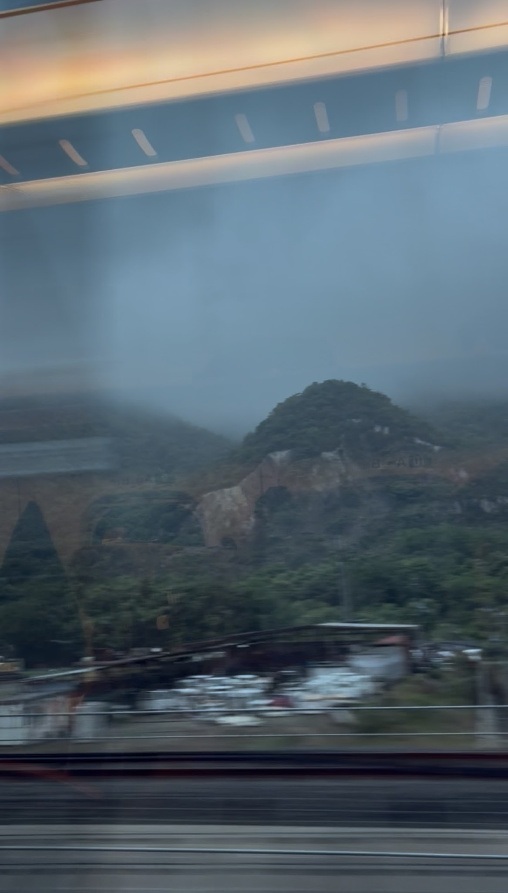
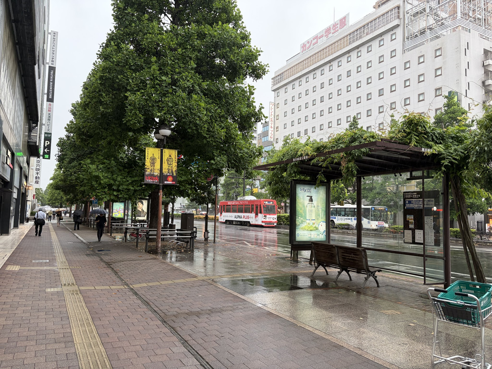
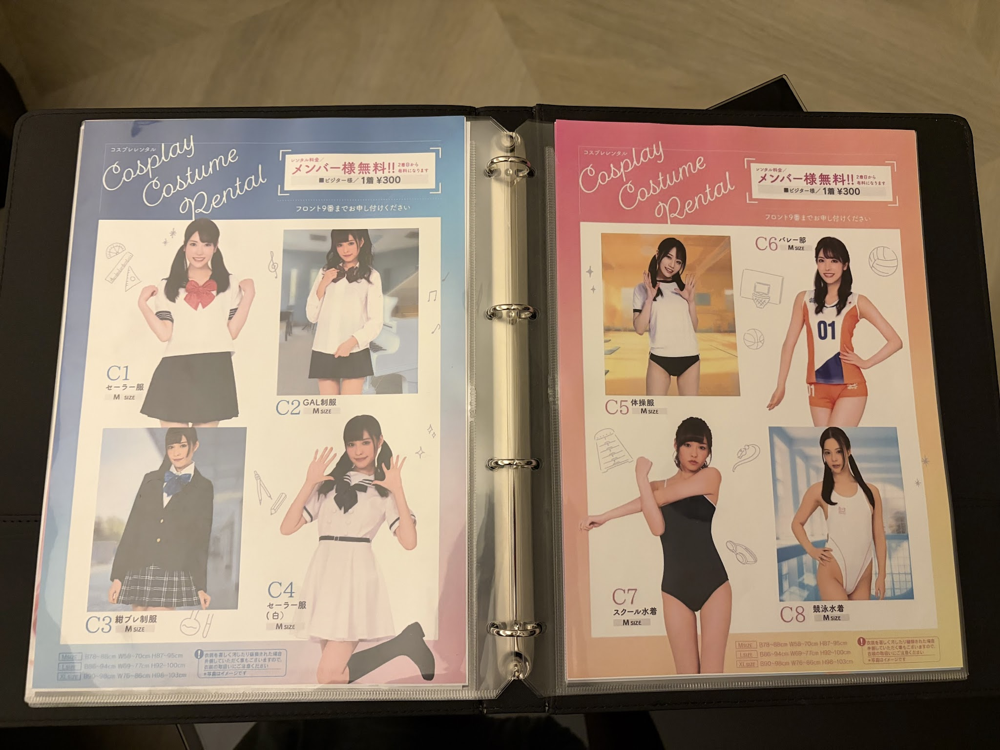
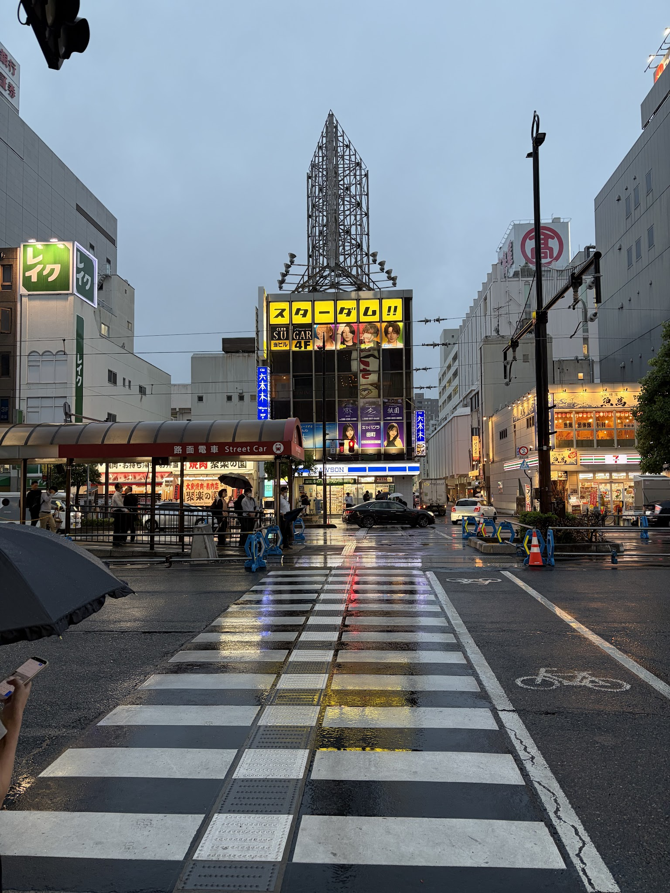
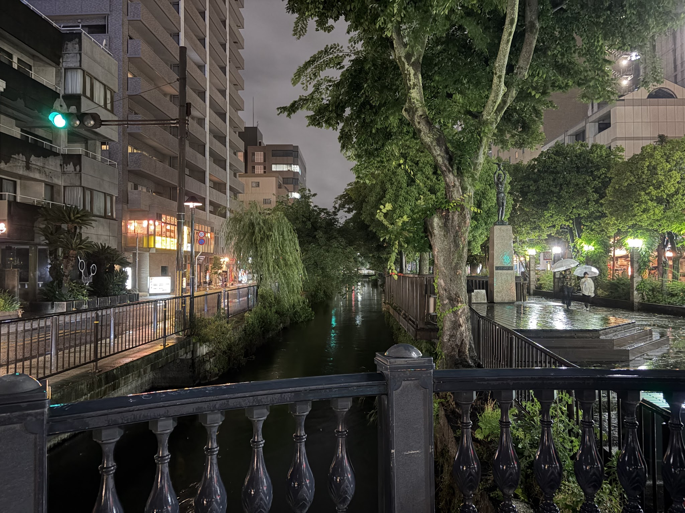
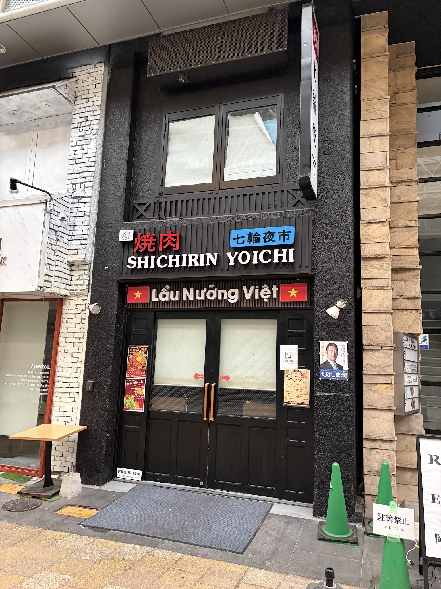
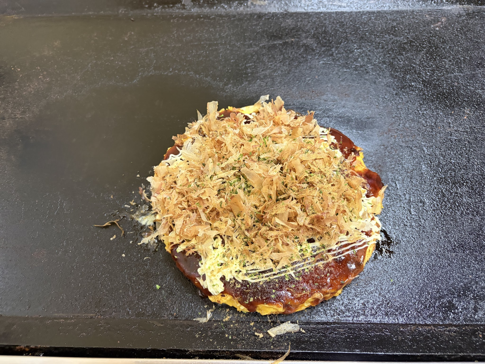
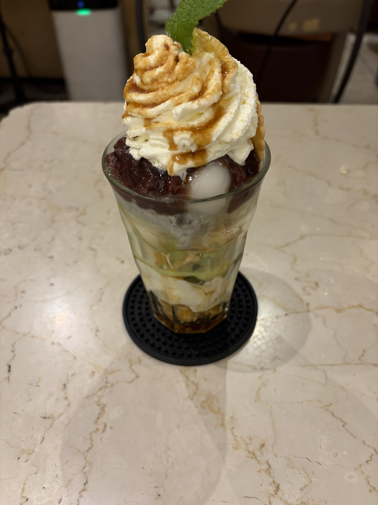

## To Okayama
I took the Hashidate train to Kyoto, then transferred to Thunderbird, then transferred to the Sanyo shinkansen to Okayama. Initially I thought it had the fewest transfers, but it turns out the shinkansen from Kyoto to Shin-Osaka isn’t covered by the Kansai Hiroshima pass, so I had to take the Thunderbird train first.

I did not manage to capture any photo of the beautiful view on the Hashidate train, because I fell asleep :(

The mystic view of the fog falling onto hill top, somewhere between Osaka and Okayama, taken on the shinkansen. The picture is a bit blurry because the shinkansen was moving fast and this was cropped from a video.

## Arrive at Okayama
I thought Okayama is a small town because there is nothing to see. It turns out that Okayama is quite a big and vibrant city.

This city has tram running along the street? That is so romantic!

I think I accidentally booked a love hotel. Besides this, they also have an array of props …

The view right at my place of stay. Not sure if I am staying in a lowkey red light district or something, but it is right at Okayama (main) station though. There are quite a lot of similar entertainment establishments in this area.

The city canal looks beautiful. This time my camera does extra justice to the canal; at the time I visited it was quite dark so it did not look as nice.

Apparently there is a mini Vietnam town here, with a whole block of Vietnamese restaurants and shops, interesting, why are there so many Vietnamese in Okayama?

## Food
### Oyster Okonomiyaki
This region is known for oysters. So I gotta try this dish.

They brought out a cooked okonomiyaki, and I got to decorate it by myself with mayonnaise and the flakes. Don’t be deceived by the layer of soy sauce: it is actually not salty. The okonomiyaki is so tasty. Looking forward to enjoying this same dish in Hiroshima.

### Fruit parfait
Hearsay Okayama is a city of fruit parfaits, so I had to find one. The name doesn’t sound Japanese though :)

The dessert is excellently flavourful, with layers of cream, fruits, red beans, mochi, jellies, cereal. I am normally not a fan of cereal, but it fits so great with the whole mixture here.

## Concluding words
Though I stayed only for half a day, I got a great food tour in the city. It is quite a big city, so if you have time, I do recommend checking out other attractions within the city.
