## To Tokyo
I took a flight from Kagoshima to Tokyo. I intended Tokyo to be a transit place only, but since there are quite a number of historical places to visit, I decided to stay here one day.
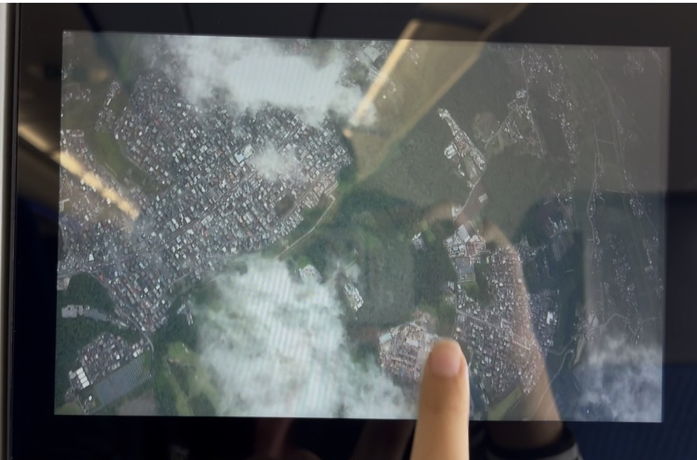

There is a front camera and a down camera of the plane, which is quite amusing.

The flight attendant was quite nice in moving me to an empty row of seats :) And she initiated some small talks with me too 👉👈 so cute. First time a flight attendant initiated small talks, are Kagoshima people really quite friendly?
## Great Kanto earthquake museum
The museum covers events surrounding the great Kanto earthquake in 1923 that reduced Tokyo to rubbles, as well as the Tokyo air raids during WWII.
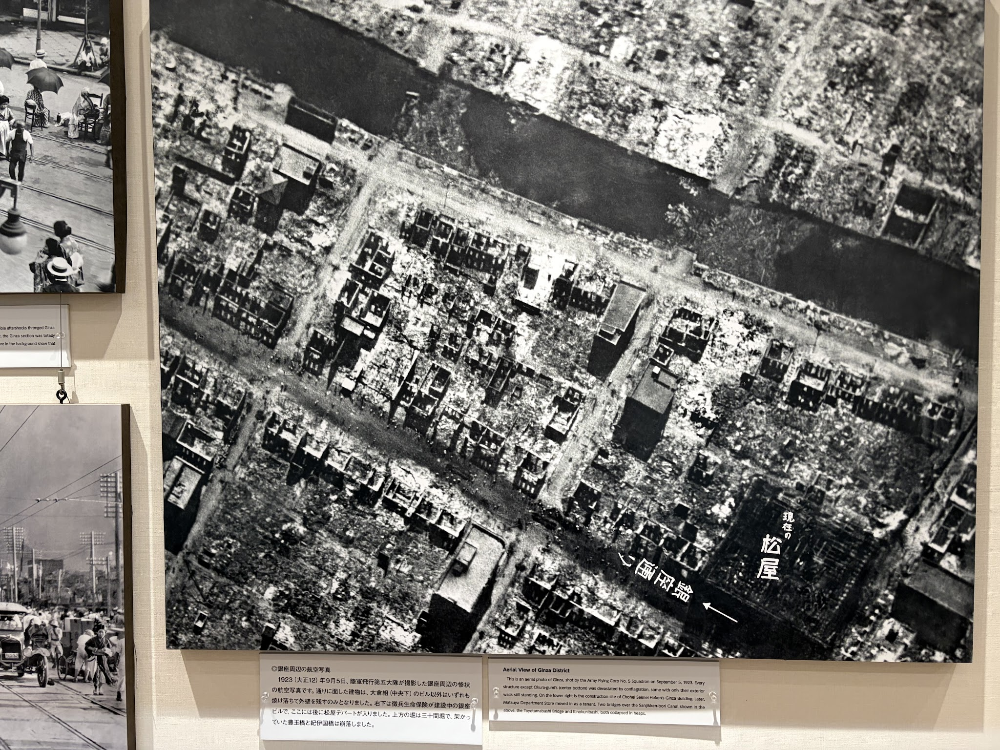

The exhibitions offer very detailed explanations into the Physics/geography explaining the earthquake, to the impact of the earthquake, and the post-earthquake relief efforts. One thing that I learned is that Tokyo used to be twice the population density of the current time, and houses used to be wooden with thatch-roofed, which led to the high casualties and the widespread fires. As a result, in the urban development plans after the earthquake, they redesigned houses.
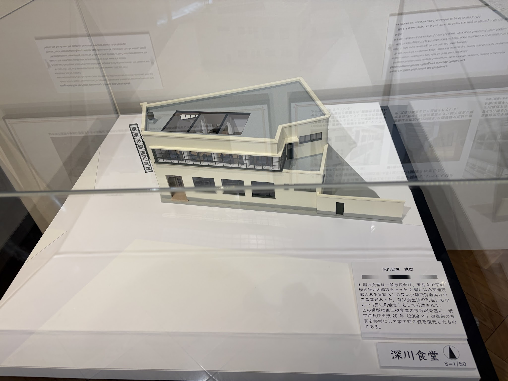

Some of the house models are on display. Also it is during the post-earthquake period that apartments started to rise.

Relief efforts came not only from the Japanese government, but also from other countries as well, particularly the United States. It is heart-warming to see lots of countries come together to provide Japan with food and medical supplies as part of the relief effort.

The second level shows the events leading to Tokyo air raids, their effects and the post-war efforts to rebuild Tokyo.
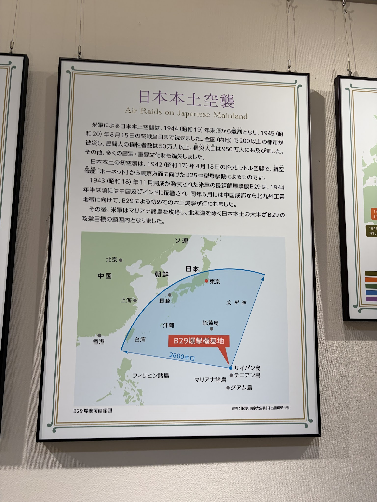

The exhibition displays great details about the key events of WWII that enabled the United States to bomb mainland Japan. There were approximately 500,000 casualties of the bombings.
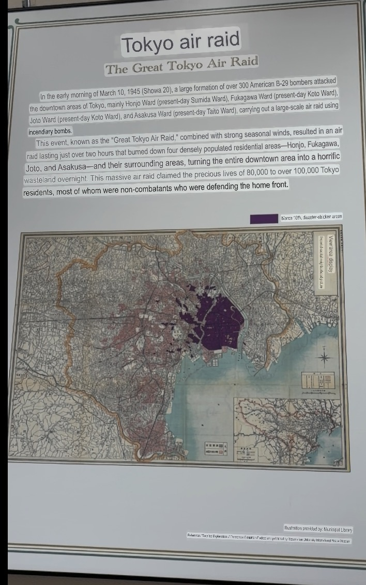

10 Mar 1945 was the great Tokyo air raid. Tokyo once again was reduced to rubbles like the Kanto earthquake. This raid alone resulted in 100,000 casualties, which is already comparable to the atomic bomb. No wonder people say, Tokyo was heavily bombed, yet Japan did not surrender, so there was strong evidence that the atomic bombs were not the primary reason that Japan surrendered (but it was rather because the Soviet Union invaded Manchuria).

Most of the important information is available in English, either by parallel subtitles for the great Kanto earthquake exhibition on level 1, or an English booklet for the Tokyo air raids on level 2, which I took home. I got chased out at the end because they were closing; fortunately I was finishing reading the final part of the exhibition. This whole museum, though small, would take me 2 hours to finish.
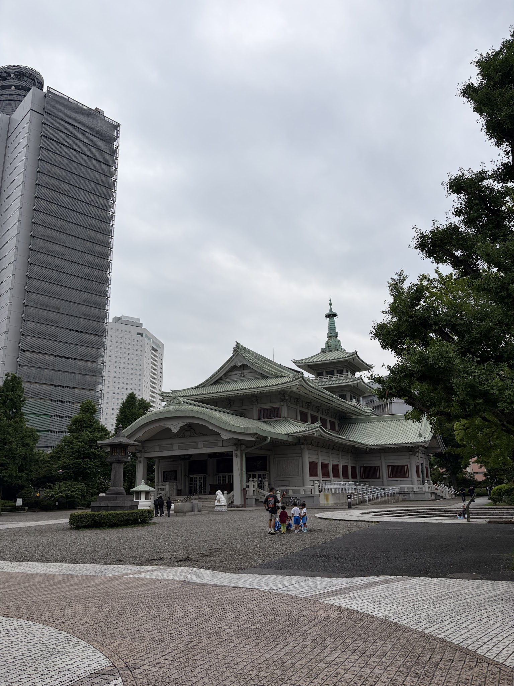

Tokyo memorial hall, commemorating those who died in the Kanto earthquake and the Tokyo air raids. I unfortunately did not have time to visit.
## Tsukemen
I resolved to have a good bowl of tsukemen, since I had a great bowl of tsukemen in Hiroshima.
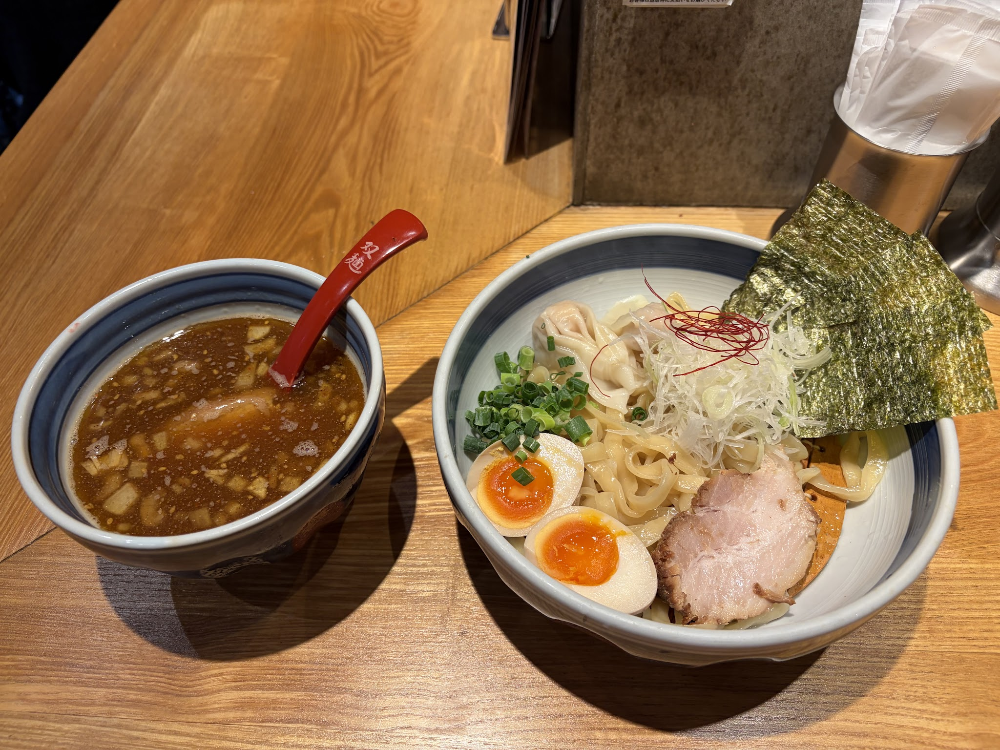

And it is great! The sauce is lighter than the one found in Hiroshima, both versions are great. The sauce, the noodles, the egg, the seaweed, the meat, everything is just right.
## Yasukuni shrine
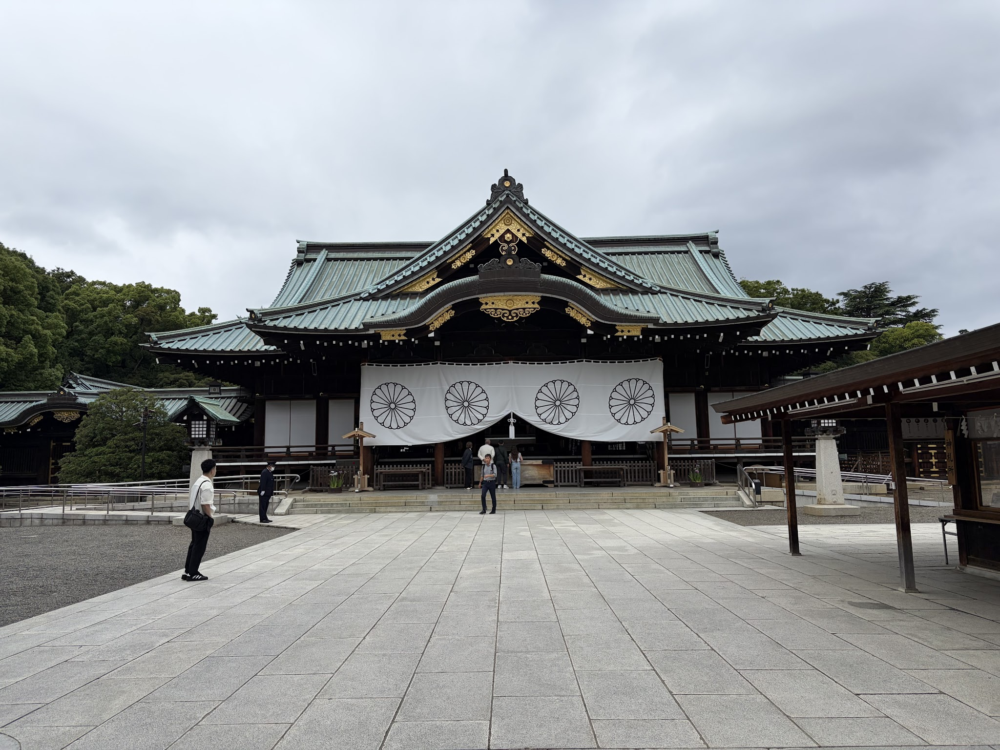

The shrine commemorates, or rather, worships, the soldiers that have fought in the wars under the imperial government. One thing I noticed is, there was a visible police presence, probably due to fears of possible protests here.
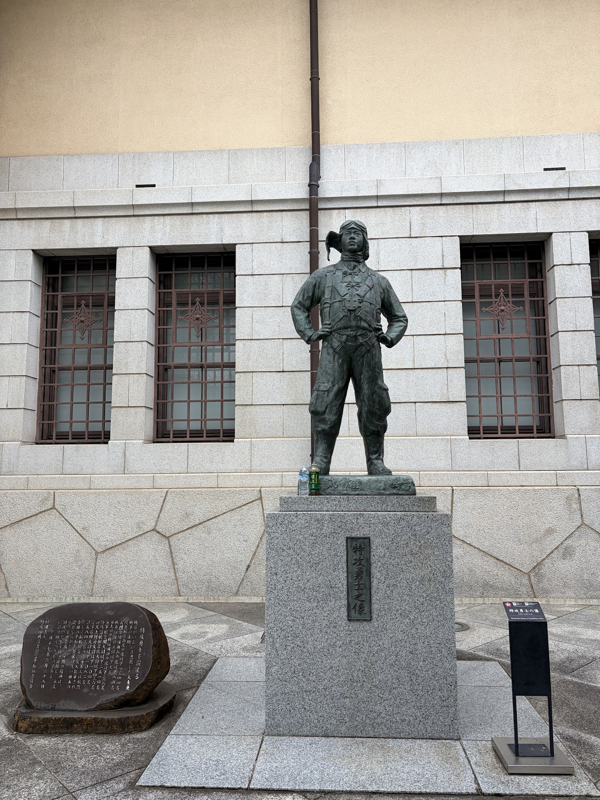

A statue of a kamikaze pilot.

They also have other statues depicting scenes like a family sending their child into the military, a widowed mother raising 3 children because their father died in war.
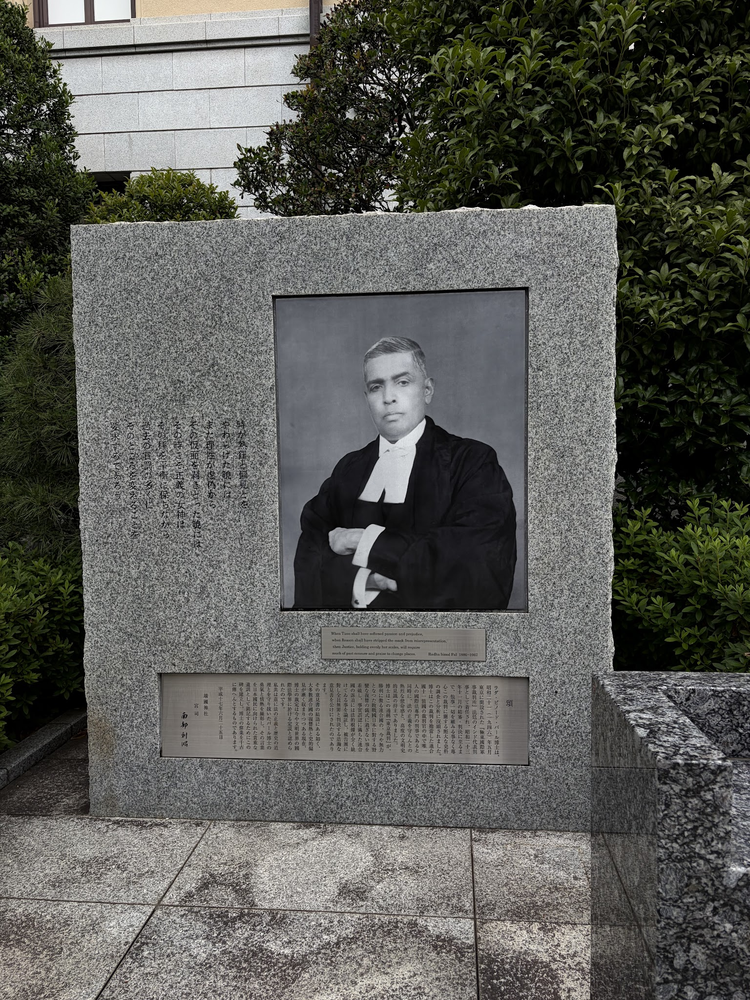

They have a memorial of Dr Pal, the only judge in the Tokyo trials that condemned the injustice of the panel. His stance is, the other Western colonial powers also committed their own atrocities, so the hearing was a trial of the victors for their own ulterior motives, not an objective trial.

Arguably, worshipping the dead is a common practice in Shinto, and worshipping the fallen soldiers in war is just another instance of the practice, but the shrine inevitably garners criticism. Perhaps, if their practices do not align with their conscience, is it time that they revise their beliefs and practices?
## Yushukan museum
This is the first place in Japan that my student card is useful: university students enjoy half the price!
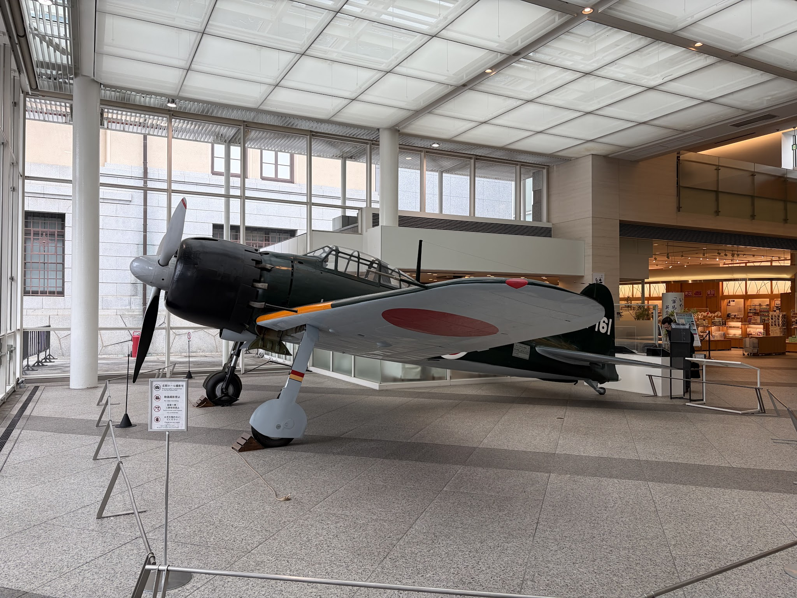

This is a war museum that details Japan’s development from pre-Meiji restoration up to the post-WWII era. Contrary to popular beliefs, it presents much much more than just WWII. It took me 3 hours to read through all the interesting information presented across the exhibitions. And there are so many exhibitions!

The above photo is a zero fighter, one of Japan's most effective airplane, which helped Japan gain air superiority during the second Sino-Japanese war.
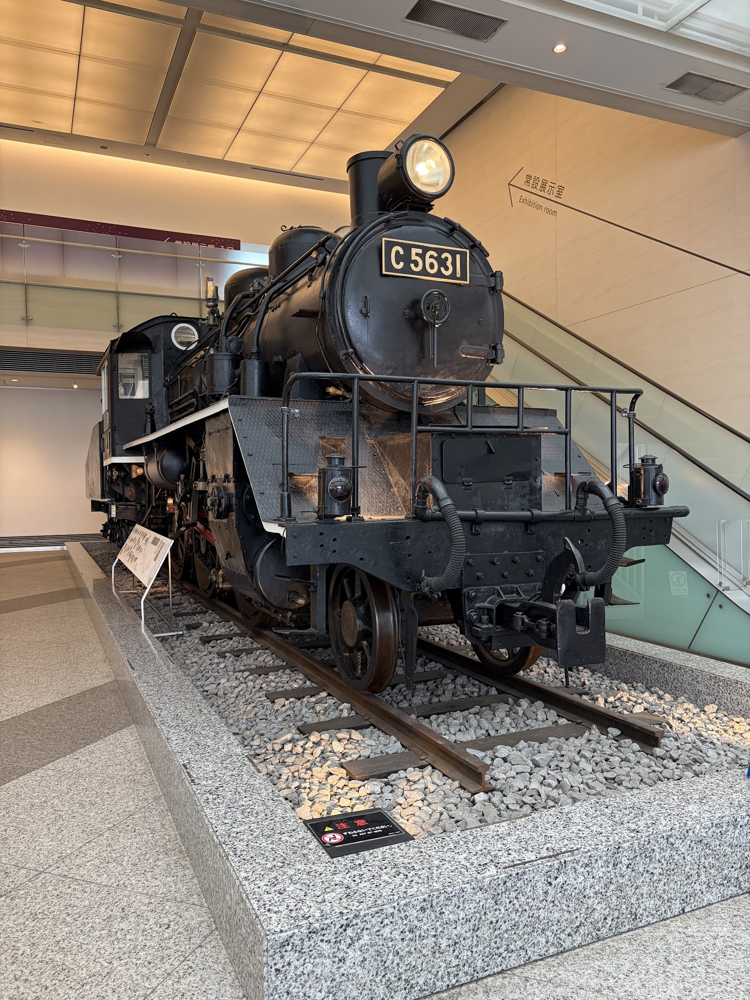

The train that operated between Thailand and Myanmar during the Japanese occupation.

The museum does not allow photos for most of its exhibitions, so I will try to narrate here as much as possible.

The museum first presents the history of the Meiji restoration. It started with the prevalence of Western ships in Asia, climaxing at Perry’s arrival of American ships. Due to the unequal treaties signed by the shogunate side, the Satsuma-Choshu alliance rose up and forced the shogun to transfer power to the emperor. There were very detailed maps of Western colonies, as well as the military campaigns in the Boshin civil war that forced the shogun to abdicate.

After the emperor took power, the modernization of Japan began. The Satsuma rebellion happened in 1877, which resulted in the defeat of the Satsumo samurai faction. A reminder here is that this rebellion did not happen in the romanticised way where the samurais fought with swords and arrows, instead, both sides used modern military technologies like guns.

At the start of Meiji restoration, the emperor himself sent his ministers and students on a 22-month journey around the world. Unlike the students in Satsuma who went westward, this journey went eastward and landed in the United States first, then crossed the ocean to land in Britain, then France, Germany, Italy, Austria, etc. Then they passed through the middle east stopping at Yemen, then passed by Sri Lanka, Saigon, Singapore, Hong Kong, to finally arrive back at Tokyo. These people played a major role in the modernization of Japan.

We then moved on to Japan’s modern wars, starting with the Sino-Japanese war. Key battles were detailed in maps, where Japan won decisively and occupied Liaodong peninsula with port Arthur. However, Japan was forced to withdraw its occupation by the Triple intervention (Russia, France, Germany), subsequently each of the European powers had their share of China.

However, that did not end there when Russia expanded its presence to Manchuria, then Korea. Japan then signed a military alliance with Britain, and attacked Russia in Korea and Manchuria. Going against a European giant with economic and military prowess a few folds of Japan, Japan surprisingly got a win, shocking the entire world. Even port Arthur, one of the most fortified ports, was captured by Japan, though not from the sea but from inland. There was a short movie explaining the details of the war, including key battles and conferences.

Next, we have the second Sino-Japanese war, starting with the Mukden incident. They admitted that it was engineered by the Japanese army. The display also includes key battles and events like the Marco Polo bridge incident and the Nanking incident. Notice my choice of word here :) I copied it from the display. While key military achievements were highlighted, little was done to highlight the atrocities that the Japanese army committed. Massacre of civilians was phrased as punishment of soldiers hiding among residents.

It is also in this period that Japan had a hard time dealing with Russia up to 1939. Border skirmishes happened due to unresolved border disputes between Manchuria and Mongolia/Russia, and Japan realised the strength of the Soviet Union. No wonder when Germany signed a non-aggression pact with the Soviet Union, Japan was not happy.

Also in the same period, the US started to be worried about Japan’s action in Asia, starting in 1937. And in 1941, the US imposed an oil embargo on Japan, which then realised that they had only a few months left for its resources. Different resources had different amounts in the stockpile, with the least one having a stockpile that lasted only 3 months. Efforts were made to negotiate with the US, who then responded with a four-principle declaration, implicitly demanding Japan to move out of China. Japan insisted on keeping China while not invading Southeast-Asia, while the US stood firm in their position. The emperor Hirohito initially set a deadline for starting war against the US in Oct 1941, which was then postponed to Nov 1941 in hopes of a successful negotiation. In the end, they attacked Pearl harbour in Dec 1941.

Maps were also shown of Japan’s military actions in Southeast-Asia, termed the Great East Asian war. Phase 1 includes pearl harbour all the way to the battle of Midway. In the battle of Midway, Japan lost 4 carriers and a huge number of aircrafts, putting Japan into a defensive position. Japan then lost Iwo Jima and Okinawa, where the US set up bases to effectively bomb mainland Japan.

The leading up day-by-day of Japan’s surrender was also shown. Previously, Japan did not accept the declaration at Potsdam conference because it did not guarantee the emperor system. Japan sought a peace deal through the Soviet Union, but it was refused, and the Soviet Union also refused to renew the neutrality pact previously signed with Japan that was to expire in 1946. After the first atomic bomb on Aug 6, 1945, Japan officials called a meeting to discuss a possibility of accepting Potsdam conference. After the second atomic bomb and Soviet invasion of Manchuria on Aug 9, 1945, Japan requested to surrender while keeping the emperor system. The Potsdam conference replied with vague phrasing that the emperor might be kept, at the discretion of the Allied power. The emperor finally made the decision to surrender, citing emperor Meiji’s decision to concede to the Triple intervention when the situation called for it.

While Japan had surrendered, Soviet military action did not stop. They advanced through Manchuria, into Korea, took Sakhalin island and the northern islands from Hokkaido. These northern island disputes last way longer after the war. To be fair, Stalin was just claiming what Roosevelt promised him when he lobbied him to declare war on Japan after Germany’s defeat. Also, Japanese were treated harshly in Soviet-captured regions, including being sent to forced labour.

After that, there was a huge array of photos displaying the soldiers that have fought in war. There were 10,000 of them, and some of them probably were involved in the second Sino-Japanese war. This is why this museum is so controversial :)

I also observed a lot of students walking around and taking notes. All of them carried a board with paper, they were probably on a school trip. A school trip to this museum is a bit sus though, aren’t they supposed to be educated to maintain peace, instead of looking at the glory of past wars?
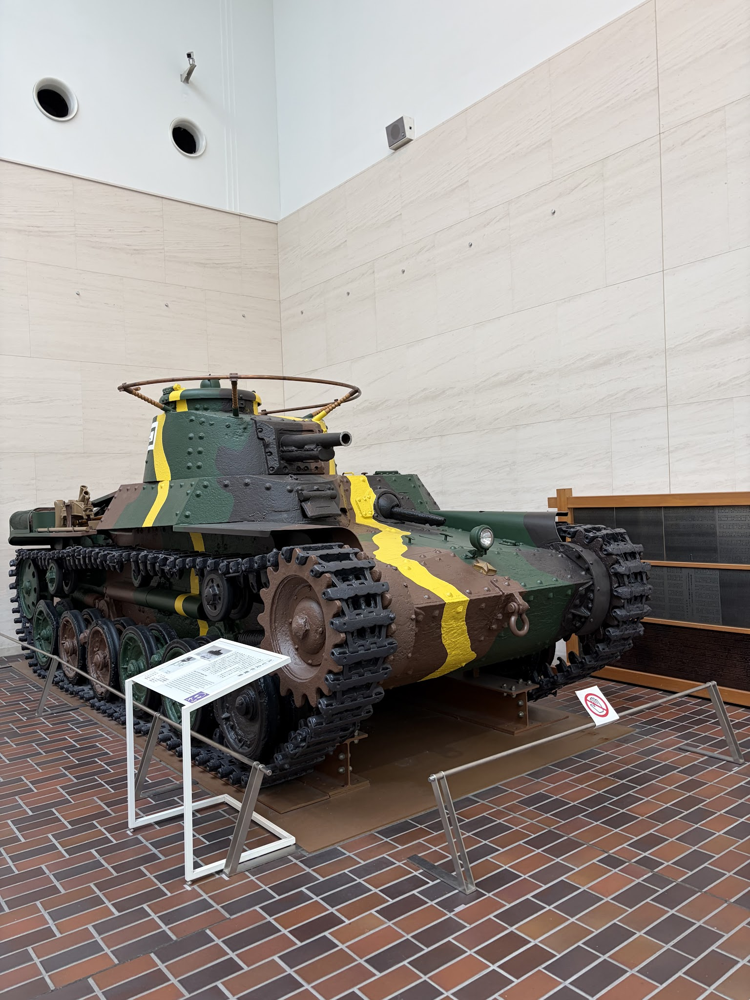

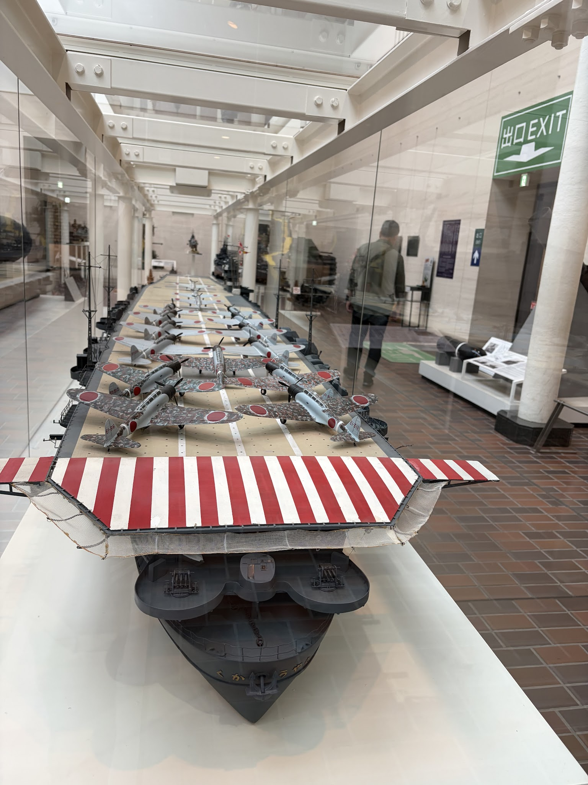

There were lots of plane, tank, aircraft carrier models on display. The only exhibition that allows photos.
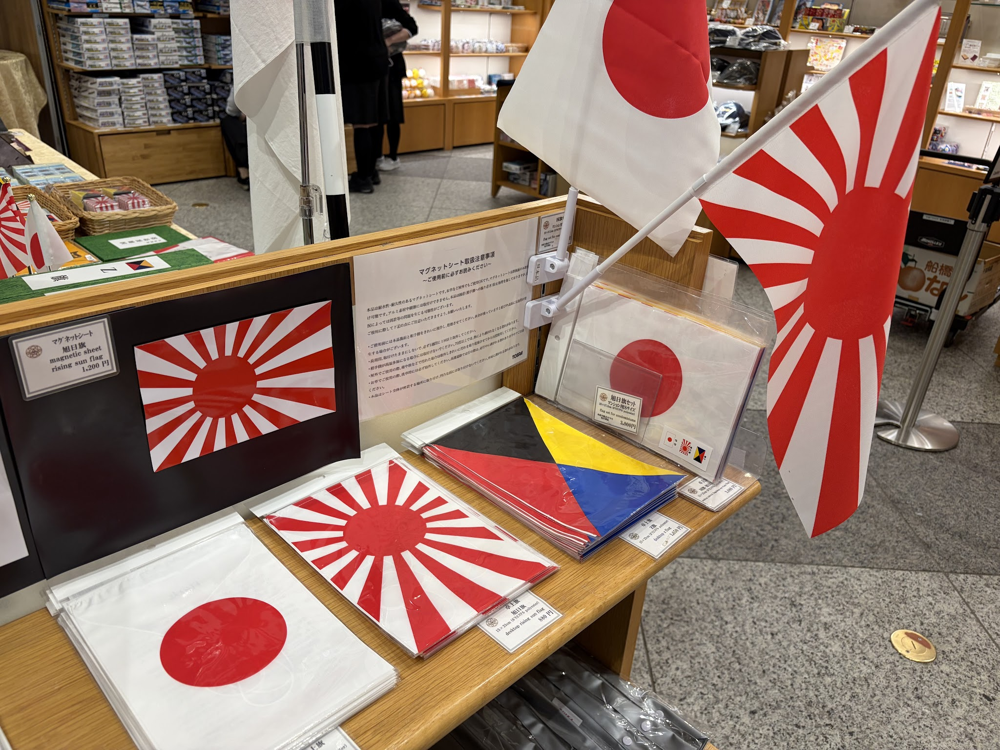

The rising sun flag on sales 🥴.
## Tonkatsu lunch
My Tokyo itinerary is weird, so the restaurants nearby only have Japanese. I managed to find a soba noodle shop that was really cheap, for a very filling lunch.
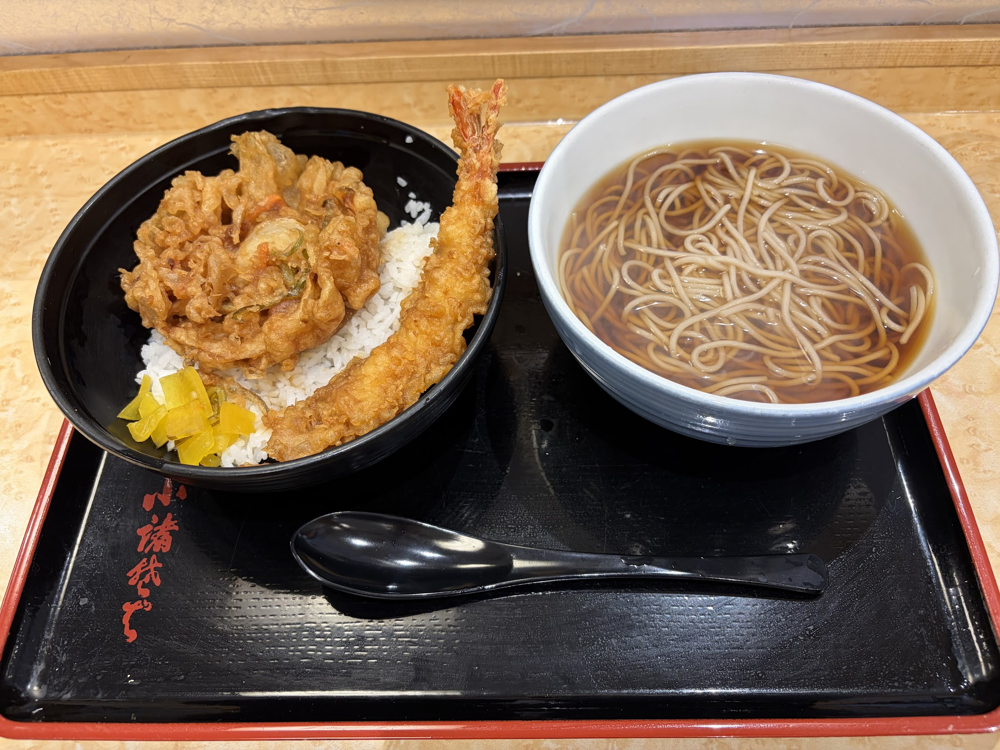

Oops, I thought it’s dry noodle. Ig I did not understand the menu thoroughly. Either way, the noodle is good! The tonkatsu is very well seasoned.

I noticed some men around me ordered only soba with soup. Huh, they can survive with that? I am astonished, probably they were trying to save money.
## Earthquake science museum
This museum has very thorough displays of the impact of earthquakes, as well as preparatory measures taken by Japan.
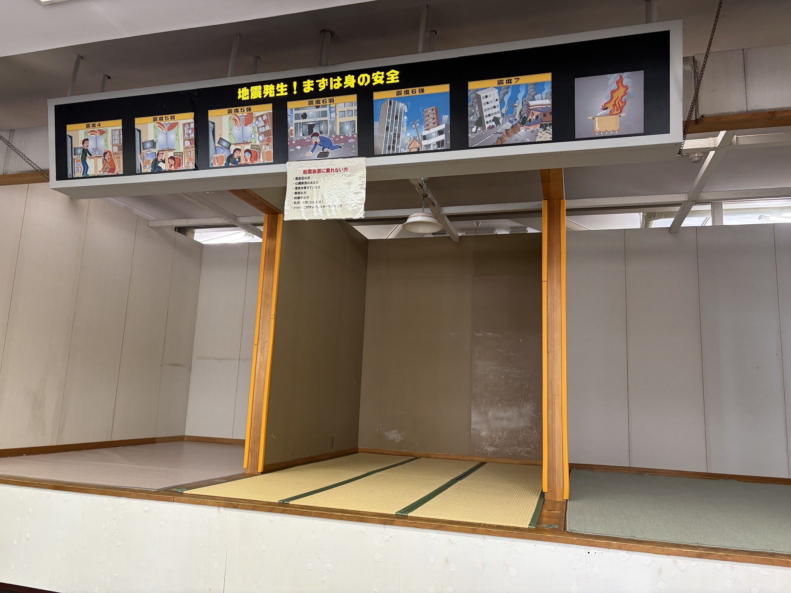

I was welcomed with an experience of the earthquake simulator! Towards magnitude 7, I could not stand firmly anymore. The Great Kanto earthquake and the Great East Japan earthquake were even crazier. With the power of the shaking, no wonder buildings just collapsed.
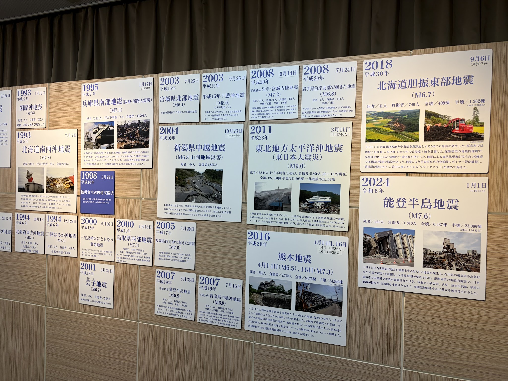

They have records of past great earthquakes, how many people died or were injured. Every year Japan has around 1000 - 2000 earthquakes that can be felt by the body, and nearly 10% of worldwide earthquakes happen in Japan. What a land of earthquakes!
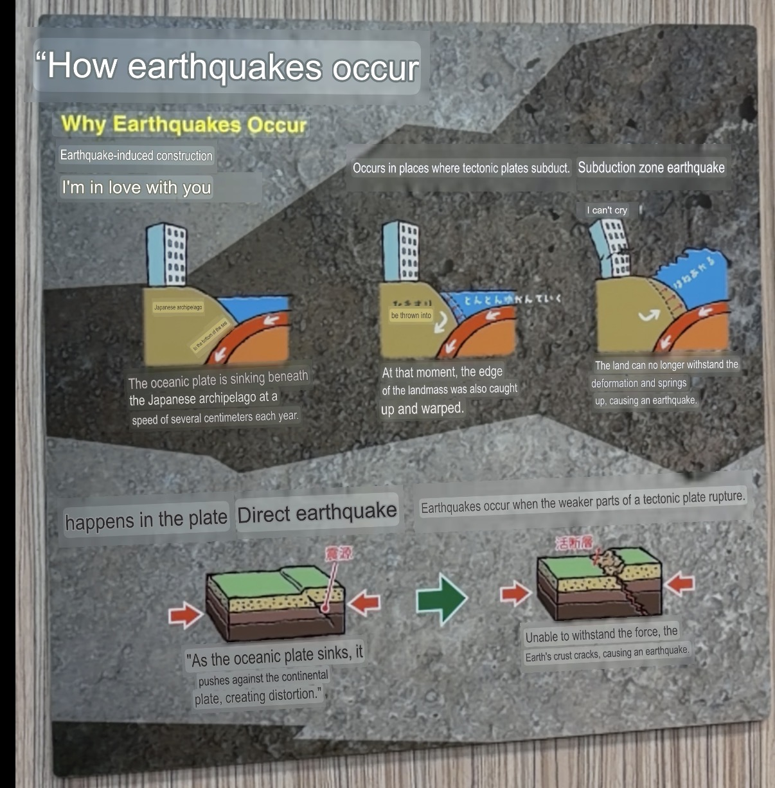

Detailed explanation of how earthquakes occur. For geography students.
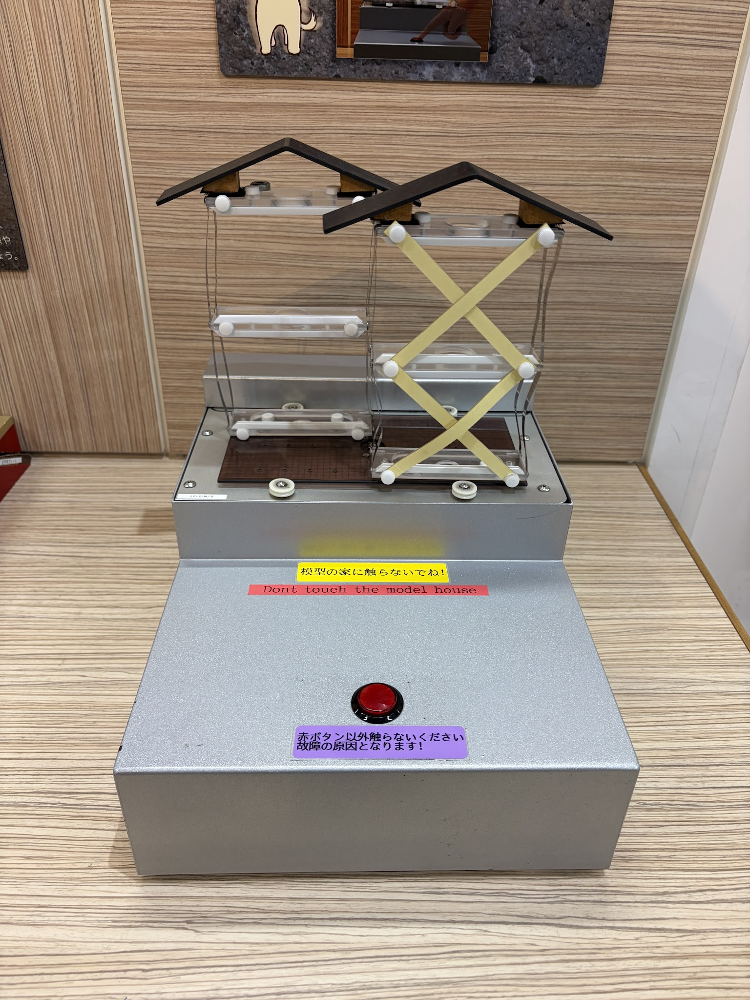

They event have simulation of how earthquake-resistant buildings were made. With better structure, the building in front can resist the quake, while the building at the back shakes vigorously.
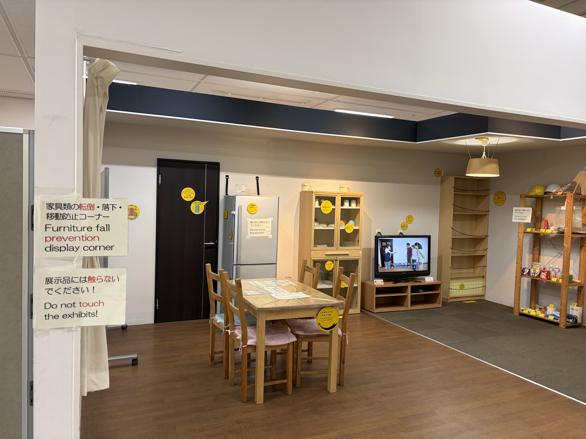

Household items with earthquake-resistant designs are on display. They have features such as latches to the wall, locks on the doors. Very cool designs, the room looks absolutely normal yet with such amazing hidden features.
## Showa museum
Showa is the official name of emperor Hirohito. Showa period points to the period of his reign. This museum shows detailed life experienced of commoners during and after the war.
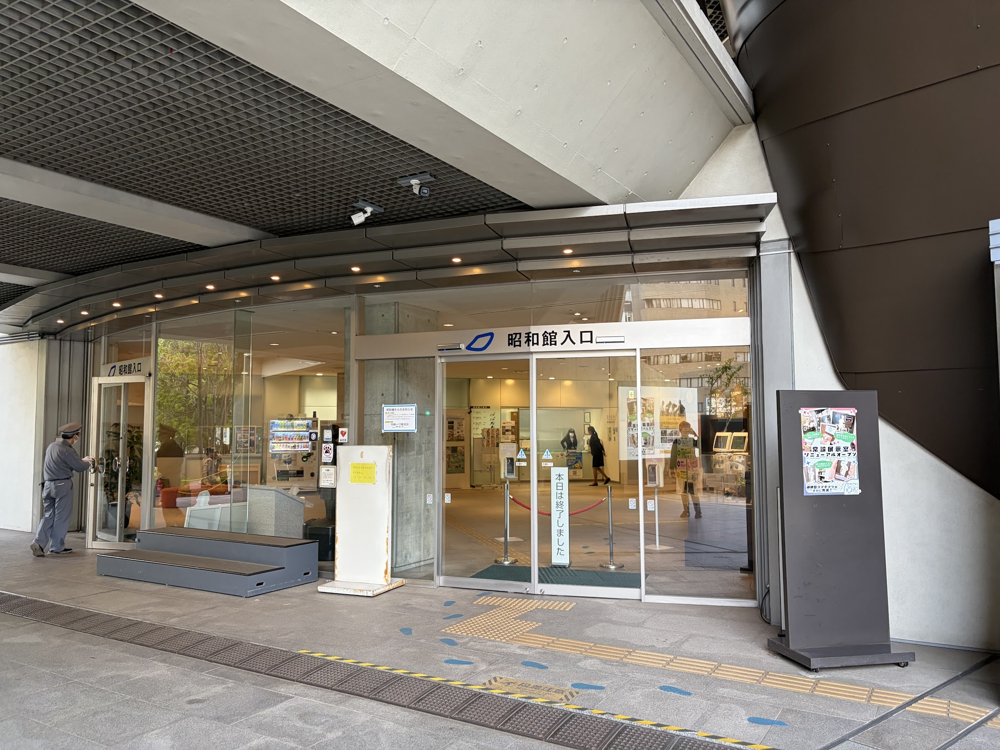

They sadly do not allow camera inside :( So again, I will try to narrate the experience.

During the war, the government encouraged the soldiers to send letters to their families. However, they heavily censored the letters, officially to prevent secret information from being leaked, under the surface also to filter out letters that decrease the morale of the people. As a result, soldiers used code names, or just simply do not express their true feelings.

Life of commoners was hard: closer to 1940, the government started to run out of metals, forcing the people to voluntarily sacrifice their metalwares. People contributed their household appliances for the frontline, that is insane. When food supplies ran short, the government started to ration food, and food rations look pathetic: it first replaced mest with vegetables, and slowly the vegetables started to disappear also. I would have complained if just one meal does not have meat.

After the war, there were “war widows” and “war orphans”, pointing to the wives losing their husbands in the frontline and the children who evacuated to the countryside and lost their parents in the city air raids. Tragic :(

Life started to improve, and in the 1950s, the symbol of wealth includes 3 electric appliances: washing machine, TV, and refridgerator.

There was an audio room where I could scroll through endless archives, from photos to videos, TV broadcasts, and music, during the Showa period. I spent a good amount of time here watching random things.
## Overpriced izakaya
Every restaurant that I went to near Showa museum was fully booked :( Huh, that was the first time I experienced everything being booked. So I headed back to the area near my hotel for dinner. Yet, there were still a few izakayas that are fully booked. Japanese people love izakaya hor. So I landed on an overpriced Italian izayaka.
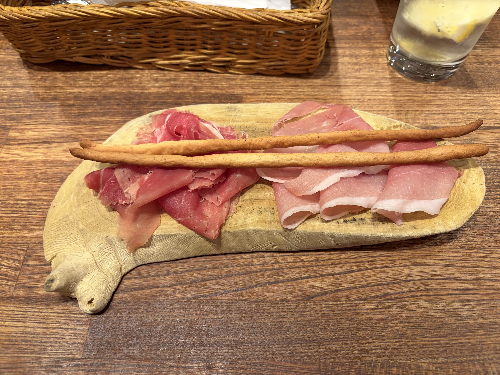

1,000-yen ham. It is quite good though, so I would say this is a little bit overpriced.

980-yen sausage. This had better be worth it. It is! It tastes really really good. But still though, the quantity does not justify the price.

The lemon drink is also mixed with soju, so it is a little bit funny. Nevertheless, food is good, but is a bit overpriced.
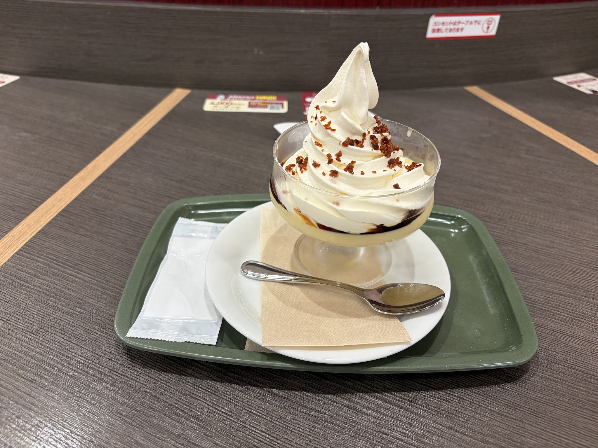

I went to a nearby cafe, waiting for the passage of time. Can’t wait to get back to Singapore.
## Concluding words
And that concludes my trip in Japan! This conclusion will run a little bit longer than my previous posts, since it is the last.

If you are looking at a perfect Tokyo itinerary, don’t look at mine! Because I have already visited Tokyo extensively, I designed my Tokyo itinerary to be a bit weird this time. Also it is because I love WWII history, so all the places on my itinerary are all the places with history. Tokyo definitely offers a lot, from shopping streets to various attractions, but I no longer have energy for that towards the end of the trip. Tokyo can feel really crowded. And that is probably fine if you travel to Japan for the first time, but for me, that is too much, which is also why I put a lot of remote areas in my itinerary. Nevertheless, if you are a history lover like me, then the above places are must-goes.

I have travelled to Japan long enough to have a more holistic evaluation of the people. Previously, I thought most if not all Japanese are nice, kind, trouble avoiders, and avoid human interactions too. But I have travelled enough to say, that is only true in big cities. People tend to fit into the crowd, and there are just too many people. But in the countryside like Iya Valley or Nagato, or smaller cities like Kagoshima, people are really talkative. Even with the language barrier, either their broken English or the limitations of Google translation, they are so willing to make small talks with me. Those instances really change how I view Japanese. I wished I had learned some conversational Japanese so I could enjoy those moments better. On the flip side, there are rude people too. There was one uncle in Shirakawago that could not tell me properly that I could not eat in the store, he instead yelled at me. There are also other reviews of rude people that I managed to read and avoid those places. In Fukuoka Tenjin mall, one uncle intentionally bumped into me. I let it pass because nothing serious ensued, but I had to wonder, what is your problem. It turns out, there is a subculture of people intentionally bumping into others in crowded places. Those are the minorities in Japan, they are rare but not non-existent.

Food too can vary, not any random restaurant you walk in would be great. I had a very bad experience with an overpriced restaurant in Kanazawa. Food was also bad in one soba noodle shop in Iya Valley, and can be average to below average at some shops. Generally, if you see reviews on Google or Tabelog, that should give you a good sense if you want to go in or not. Moreover, restaurants usually put their menus outside, so you can take a look before going in. In terms of reviews, you can opt to use Tabelog if you wish, a rating of 3.2 or above should be a safe option. However, I would say Tabelog is more catered towards locals, you might get a bad experience visiting a highly rated restaurant on Tabelog as a foreigner. So, if you don’t know Japanese, try to use Google maps instead, and use Tabelog only to verify its quality.

Places of visit also can vary in quality, not every recommended place suits you. I thoroughly enjoyed most of my trip, however, in Fukuoka, I felt like I had wasted one day visiting temples that are trash. Perhaps you can think very carefully whether you want to go to those places, so that your itinerary is tailored to you, instead of just following online recommendations blindly. You may also want to go out of the mainstream blogs to find the hidden gems, the things that you would enjoy. I did that for Tokyo, and that rewarded me so well: even when it was already at the end of the trip, I was more excited than ever. Also, do research on the weather before you go, I did not get to enjoy the utmost beauty at some places due to poor vision.

Throughout my trip, I also got trolled by AI multiple times: it gives false information on transport, makes factual errors on some exhibitions and history, recommends me to visit a red-light district at night without telling me it is a red-light district (Nakasu in Fukuoka), etc. It can do the job most of the time, but take what it says with a pinch of salt.

Overall, that was a whirlwind of experiences in Japan, and unlike last time, I can say I have had enough of Japan! Well, let me take a break for a while from travelling and earn a bit of money. Until then, see you!
